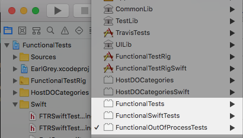

# Running the Functional Tests

For running the Functional Tests, please add
[fishhook](https://github.com/facebook/fishhook) to the parent EarlGreyV2
directory as a submodule. Similarly add
[eDistantObject](https://github.com/google/eDistantObject) for adding support
for communicating between the different XCUITest processes.

```
git submodule add https://github.com/google/eDistantObject eDistantObject
git submodule add https://github.com/facebook/fishhook fishhook
```

Once added, you should be able to open the Functional Tests Project and then run
the `Functional Tests` target.

The Project contains three main test schemes:



1.  EarlGrey 2.0 Functional Tests

    Targets:

    *   Functional Tests: The XCUITest target which contains the canonical
        EarlGrey test sources (to be run in the test process).
    *   FunctionalTestRig: The Application under test with all its resources (to
        be run in the app process).
    *   HostDOCategories: Distant Object Categories (to be run in the app
        process, with headers exposed to the test process).

2.  EarlGrey 2.0 Out-Of-Process Tests

    Targets:

    *   Functional Out-Of-Process Tests: The XCUITest target which contains
        tests that interact with System Alerts and backgrounding /
        foregrounding.
    *   FunctionalTestRig: The Application under test with all its resources (to
        be run in the app process).

3.  EarlGrey 2.0 Functional Tests

    Targets:

    *   Functional Swift Tests: The Swift XCUITest target which contains the
        Swift test sources (to be run in the test process).
    *   FunctionalTestRigSwift: The Application under test with all its
        resources (to be run in the app process) for running Swift Tests.
    *   HostDOCategoriesSwift: Distant Object Extensions in Swift (to be run in
        the app process, with headers exposed to the test process).
